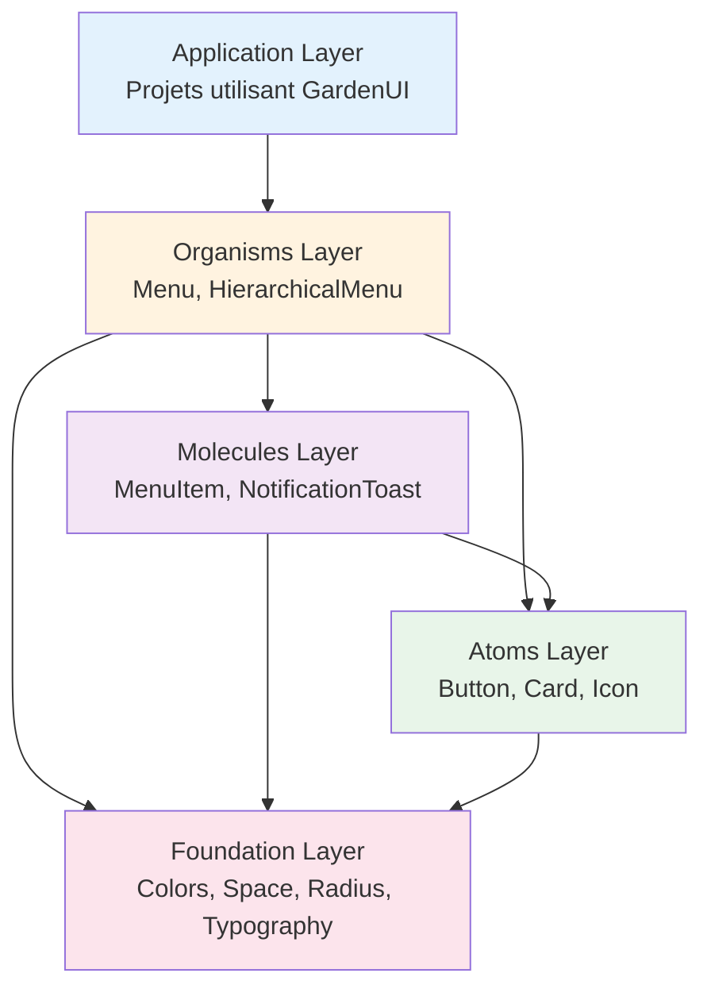
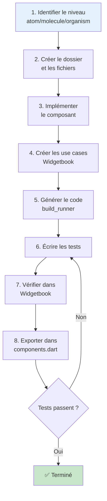
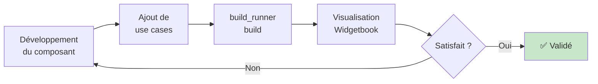

# Architecture du projet

## Vue d'ensemble

GardenUI est une librairie de composants Flutter structurée selon les principes de l'**Atomic Design**. Cette architecture garantit une évolutivité optimale, une maintenabilité aisée et une collaboration efficace entre développeurs et designers.

## Structure globale

```
GardenUI/
├── lib/
│   ├── main.dart                    # Point d'entrée Widgetbook
│   ├── main.directories.g.dart      # Catalogue généré
│   └── ui/
│       ├── design_system.dart       # Export principal
│       ├── components.dart          # Export des composants
│       ├── foundation/              # Design tokens
│       ├── widgets/                 # Composants UI
│       ├── models/                  # Modèles de données
│       ├── enums/                   # Énumérations
│       └── assets/                  # Ressources (SVG, etc.)
├── test/                            # Tests miroirs de lib/
├── docs/                            # Documentation DIATAXIS
└── .github/workflows/               # CI/CD
```

## Architecture en couches

GardenUI suit une architecture en couches, du plus basique au plus complexe :



### Règles de dépendances

**Principe :** Les couches ne peuvent dépendre que des couches inférieures.

- **Organisms** → Molecules + Atoms + Foundation
- **Molecules** → Atoms + Foundation
- **Atoms** → Foundation uniquement
- ❌ **Atoms** ne peuvent PAS dépendre de Molecules
- ❌ **Molecules** ne peuvent PAS dépendre d'Organisms

## Dossier `lib/ui/`

Le cœur de la librairie, organisé par responsabilité.

### `foundation/`

Contient les **design tokens** : les valeurs de base du design system.

```
foundation/
├── color/
│   ├── color_design_system.dart      # Palettes de couleurs
│   ├── color_preview.dart            # Aperçu Widgetbook
│   └── color_usecase.dart            # Use cases Widgetbook
├── padding/
│   └── space_design_system.dart      # Espacements (padding/gap)
├── radius/
│   └── radius_design_system.dart     # Rayons de bordure
├── shadow/
│   └── shadow_design_system.dart     # Ombres et élévation
└── typography/
    └── typography_design_system.dart # Styles typographiques
```

**Responsabilité :** Centraliser toutes les valeurs de style réutilisables.

**Exports :** Via `lib/ui/design_system.dart`

### `widgets/`

Contient tous les composants UI, organisés par niveau atomique.

```
widgets/
├── atoms/
│   ├── Button/
│   │   ├── button.dart
│   │   └── button_usecase.dart
│   ├── Card/
│   ├── GardenIcon/
│   └── ...
├── molecules/
│   ├── MenuItem/
│   │   ├── menu_item.dart
│   │   └── menu_item_usecase.dart
│   └── ...
└── organisms/
    ├── Menu/
    │   ├── menu.dart
    │   └── menu_usecase.dart
    └── ...
```

**Convention :** Chaque composant a son propre dossier avec :
- `{nom}.dart` : Implémentation
- `{nom}_usecase.dart` : Cas d'usage Widgetbook

### `models/`

Modèles de données utilisés par les composants.

```dart
// Exemple : user_profile_model.dart
class UserProfileModel {
  const UserProfileModel({
    required this.name,
    required this.email,
  });
  
  final String name;
  final String email;
}
```

**Quand créer un modèle :**
- Données structurées complexes
- Réutilisé par plusieurs composants
- Logique de validation/transformation

### `enums/`

Énumérations pour les types et états.

```dart
// Exemple : notification_type.dart
enum NotificationType {
  success,
  error,
  warning,
  info,
}
```

### `assets/`

Ressources statiques intégrées à la librairie.

```
assets/
├── icons/
│   ├── logo.svg
│   ├── menu_icon.svg
│   └── ...
└── (autres ressources)
```

## Dossier `test/`

Structure miroir de `lib/ui/widgets/`.

```
test/
├── atoms/
│   ├── button_test.dart
│   ├── card_test.dart
│   └── ...
├── molecules/
│   ├── menu_item_test.dart
│   └── ...
└── organisms/
    ├── menu_test.dart
    └── ...
```

**Convention :** `{composant}_test.dart` teste `{composant}.dart`

## Génération de code

GardenUI utilise `build_runner` pour générer automatiquement certains fichiers.

### Fichiers générés

```
lib/
├── main.directories.g.dart          # ← Généré par Widgetbook
└── ... autres .g.dart files
```

**Commande :**
```bash
dart run build_runner build --delete-conflicting-outputs
```

### Annotations

Les annotations `@UseCase` dans les fichiers `*_usecase.dart` sont analysées pour générer le catalogue Widgetbook.

```dart
@widgetbook.UseCase(name: 'Default', type: GardenButton)
Widget gardenButtonDefault(BuildContext context) {
  return GardenButton(label: 'Test', onPressed: () {});
}
```

## Widgetbook : Le catalogue interactif

Widgetbook génère automatiquement un catalogue navigable de tous les composants.

### Point d'entrée

**Fichier :** `lib/main.dart`

```dart
void main() {
  runApp(const WidgetbookApp());
}
```

L'application Widgetbook utilise `main.directories.g.dart` pour construire l'arborescence des composants.

### Navigation

```
Widgetbook App
├── Atoms
│   ├── GardenButton
│   │   ├── Default
│   │   ├── Disabled
│   │   └── Long Text
│   ├── GardenCard
│   └── ...
├── Molecules
│   ├── MenuItem
│   └── ...
└── Organisms
    ├── Menu
    └── ...
```

## Flux de développement

### Création d'un nouveau composant



### Workflow avec Widgetbook



## Exports

### Export principal : `design_system.dart`

Regroupe TOUT le nécessaire pour utiliser GardenUI.

```dart
// lib/ui/design_system.dart
export 'components.dart';           // Tous les composants
export 'foundation/color/color_design_system.dart';
export 'foundation/padding/space_design_system.dart';
export 'foundation/radius/radius_design_system.dart';
// ... autres exports foundation
```

### Export des composants : `components.dart`

```dart
// lib/ui/components.dart

// Atoms
export 'widgets/atoms/Button/button.dart';
export 'widgets/atoms/Card/card.dart';
// ...

// Molecules
export 'widgets/molecules/MenuItem/menu_item.dart';
// ...

// Organisms
export 'widgets/organisms/Menu/menu.dart';
// ...

// Models
export 'models/user_profile_model.dart';
// ...

// Enums
export 'enums/notification_type.dart';
// ...
```

**Usage dans les projets :**
```dart
import 'package:garden_ui/ui/design_system.dart';
// Accès à tout : GardenButton, GardenColors, GardenSpace, etc.
```

## CI/CD et qualité

### GitHub Actions

Deux workflows principaux :

1. **analyze_and_test** (à chaque push/PR)
   - Analyse statique (`flutter analyze`)
   - Tests unitaires (`flutter test`)

2. **release** (à la création d'une release)
   - Validation complète
   - Vérification de version

### Quality gates

Avant le merge :
- ✅ Analyse sans erreurs
- ✅ Tous les tests passent
- ✅ Couverture > 80%
- ✅ Code formaté (`dart format`)

## Principes architecturaux

### 1. Séparation des responsabilités

Chaque couche a un rôle bien défini et ne doit pas empiéter sur les autres.

### 2. Réutilisabilité

Les composants doivent être génériques et réutilisables dans divers contextes.

### 3. Composition over inheritance

Privilégier la composition de composants simples plutôt que l'héritage.

### 4. Design Tokens partout

Toujours utiliser les tokens de foundation au lieu de valeurs hardcodées.

### 5. Testabilité

Chaque composant doit être testable indépendamment.

## Évolutivité

### Ajouter de nouveaux design tokens

1. Ajouter dans `lib/ui/foundation/{type}/`
2. Exporter dans `design_system.dart`
3. Documenter dans `docs/reference/design-tokens.md`

### Ajouter un nouveau niveau atomique

Si nécessaire (par exemple "templates"), créer :
```
lib/ui/widgets/templates/
test/templates/
```

### Migrer vers une autre plateforme

L'architecture permet de réutiliser les design tokens et la logique sur d'autres plateformes (Web Components, React, etc.) en adaptant uniquement la couche d'implémentation.

## Voir aussi

- [Atomic Design expliqué](atomic-design.md)
- [Philosophie du design system](design-system-philosophy.md)
- [Structure du projet](project-structure.md)
- [Guidelines de composants](component-guidelines.md)

