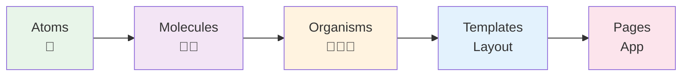
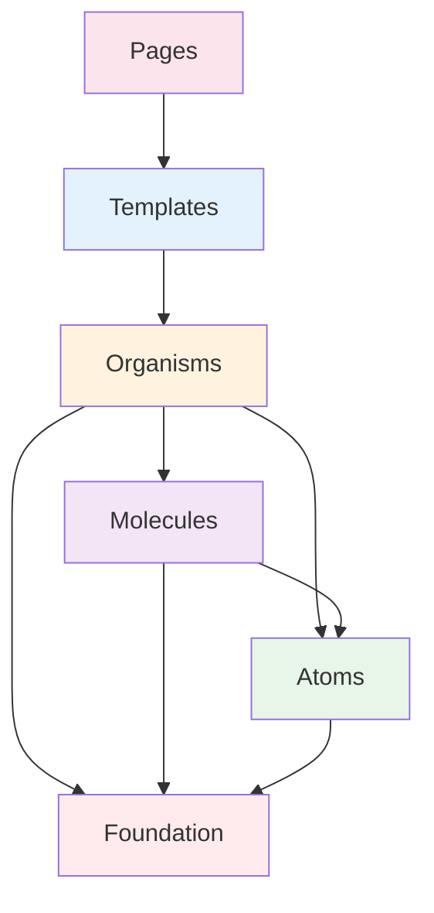
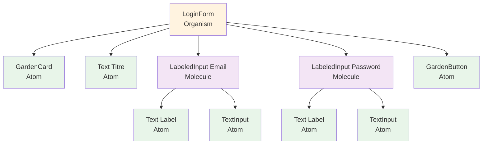

# Atomic Design

## Introduction

L'**Atomic Design** est une méthodologie de conception d'interfaces créée par Brad Frost. Elle s'inspire de la chimie : tout comme la matière est composée d'atomes qui forment des molécules puis des organismes, les interfaces sont construites à partir de composants simples qui se combinent pour former des éléments plus complexes.

GardenUI applique cette méthodologie pour créer un design system cohérent, évolutif et maintenable.

## Les 5 niveaux de l'Atomic Design



**Note :** GardenUI implémente les 3 premiers niveaux (Atoms, Molecules, Organisms). Templates et Pages sont laissés aux applications utilisant la librairie.

---

## 1. Atoms (Atomes)

### Définition

Les **atoms** sont les composants UI les plus basiques et indivisibles. Ils ne peuvent pas être décomposés davantage sans perdre leur fonction.

### Caractéristiques

- Autonomes et indépendants
- Hautement réutilisables
- Ne dépendent que de la fondation (design tokens)
- Pas de logique métier complexe
- ❌ Ne combinent pas d'autres composants

### Exemples dans GardenUI

#### GardenButton
Un simple bouton avec label et callback.

```dart
GardenButton(
  label: 'Cliquez-moi',
  onPressed: () => print('Cliqué'),
)
```

**Pourquoi c'est un atom ?**
- Indivisible (un bouton ne peut pas être simplifié davantage)
- Réutilisable partout
- Fonction unique et claire

#### GardenIcon
Une icône stylisée.

```dart
GardenIcon(
  icon: Icons.home,
  color: GardenColors.primary,
)
```

#### GardenCard
Un conteneur avec élévation.

```dart
GardenCard(
  child: Text('Contenu'),
)
```

### Analogie chimique

Comme les atomes en chimie, les atoms UI sont les briques de base qui ne peuvent être divisées.

---

## 2. Molecules (Molécules)

### Définition

Les **molecules** sont des compositions de plusieurs atoms qui forment une unité fonctionnelle cohérente.

### Caractéristiques

- Combinent 2 à 5 atoms
- Ajoutent une fonctionnalité simple
- Réutilisables dans différents contextes
- Peuvent avoir un état interne
- ❌ Ne dépendent pas d'autres molecules

### Exemples dans GardenUI

#### MenuItem
Combine une icône + un label.

```dart
MenuItem(
  icon: Icons.home,
  label: 'Accueil',
  isSelected: true,
  onTap: () => navigate(),
)
```

**Composition :**
- `MenuIcon` (atom) → Icône
- `Text` (atom Flutter) → Label
- Logique de sélection

**Pourquoi c'est une molecule ?**
- Combine plusieurs atoms (icône + texte)
- Fonction claire (item de menu)
- Réutilisable partout où on a besoin d'un menu item

#### NotificationToast
Combine icône + message + bouton de fermeture.

```dart
NotificationToast(
  message: 'Succès !',
  type: NotificationType.success,
  onDismiss: () => hide(),
)
```

**Composition :**
- Icône (atom)
- Texte (atom)
- Bouton de fermeture optionnel (atom)
- Container stylisé (atom)

#### SearchField
Combine un champ de texte + icône de recherche + bouton clear.

```dart
SearchField(
  hintText: 'Rechercher...',
  onChanged: (value) => search(value),
)
```

### Analogie chimique

Comme H₂O (eau) est formé de 2 atomes, une molecule UI combine plusieurs atoms pour créer quelque chose de nouveau avec sa propre fonction.

---

## 3. Organisms (Organismes)

### Définition

Les **organisms** sont des sections complexes d'interface qui combinent atoms et molecules pour former une partie distincte et complète de l'UI.

### Caractéristiques

- Combinent atoms ET molecules
- Peuvent contenir de la logique métier
- Représentent une fonctionnalité complète
- Peuvent avoir un état complexe
- Peuvent être spécifiques à un contexte

### Exemples dans GardenUI

#### Menu
Menu de navigation complet.

```dart
Menu(
  items: [
    MenuItemData(icon: Icons.home, label: 'Accueil'),
    MenuItemData(icon: Icons.settings, label: 'Paramètres'),
    MenuItemData(icon: Icons.help, label: 'Aide'),
  ],
  selectedIndex: 0,
  onItemSelected: (index) => navigate(index),
)
```

**Composition :**
- Plusieurs `MenuItem` (molecules)
- Container de layout
- Logique de sélection
- Gestion de l'état

**Pourquoi c'est un organism ?**
- Combine plusieurs molecules
- Fonctionnalité complète (menu entier, pas juste un item)
- Logique métier (navigation, sélection)

#### HierarchicalMenu
Menu avec hiérarchie et sous-menus.

```dart
HierarchicalMenu(
  items: [
    HierarchicalMenuItemData(
      id: 'docs',
      label: 'Documents',
      children: [
        HierarchicalMenuItemData(id: 'personal', label: 'Personnel'),
        HierarchicalMenuItemData(id: 'work', label: 'Travail'),
      ],
    ),
  ],
  onItemSelected: (id) => navigate(id),
)
```

**Composition :**
- Plusieurs `HierarchicalMenuItem` (molecules)
- Logique d'expansion/réduction
- Gestion de la hiérarchie
- État de navigation

### Analogie chimique

Comme un organisme vivant combine de nombreuses molécules pour former un système fonctionnel (cellule, organe), un organism UI combine molecules et atoms pour créer une section complète de l'interface.

---

## 4. Templates (Non implémentés dans GardenUI)

### Définition

Les **templates** définissent la structure de mise en page d'une page, en plaçant les organisms dans un contexte.

### Caractéristiques

- Définissent le layout global
- Utilisent des placeholders pour le contenu
- Réutilisables pour plusieurs pages similaires

### Exemple conceptuel

```dart
class DashboardTemplate extends StatelessWidget {
  const DashboardTemplate({
    super.key,
    required this.sideMenu,
    required this.header,
    required this.content,
  });

  final Widget sideMenu;    // Organism
  final Widget header;      // Organism
  final Widget content;     // Variable

  @override
  Widget build(BuildContext context) {
    return Row(
      children: [
        sideMenu,
        Expanded(
          child: Column(
            children: [
              header,
              Expanded(child: content),
            ],
          ),
        ),
      ],
    );
  }
}
```

**Responsabilité :** Application utilisant GardenUI

---

## 5. Pages (Non implémentées dans GardenUI)

### Définition

Les **pages** sont les instances spécifiques de templates avec du contenu réel.

### Exemple conceptuel

```dart
class HomePage extends StatelessWidget {
  @override
  Widget build(BuildContext context) {
    return DashboardTemplate(
      sideMenu: Menu(items: mainMenuItems),
      header: AppHeader(title: 'Accueil'),
      content: HomeContent(),  // Contenu spécifique
    );
  }
}
```

**Responsabilité :** Application utilisant GardenUI

---

## Hiérarchie et dépendances

### Graphe de dépendances



### Règles strictes

1. **Atoms** → Dépendent uniquement de **Foundation**
2. **Molecules** → Dépendent de **Atoms** + **Foundation**
3. **Organisms** → Dépendent de **Molecules** + **Atoms** + **Foundation**
4. **Templates** → Dépendent de **Organisms** + ...
5. **Pages** → Dépendent de **Templates** + ...

### ❌ Dépendances interdites

- Atoms ne peuvent PAS dépendre de Molecules
- Molecules ne peuvent PAS dépendre d'Organisms
- Les couches ne peuvent PAS avoir de dépendances circulaires

---

## Avantages de l'Atomic Design

### 1. Cohérence

Tous les composants partagent les mêmes atoms de base, garantissant une apparence cohérente.

```dart
// Même bouton partout
GardenButton(label: 'OK', onPressed: () {})
```

### 2. Réutilisabilité

Les composants sont conçus pour être réutilisés dans de nombreux contextes.

```dart
// MenuItem utilisé dans Menu, Drawer, Dropdown...
MenuItem(icon: Icons.home, label: 'Accueil')
```

### 3. Maintenabilité

Modifier un atom met à jour automatiquement tous les composants qui l'utilisent.

```dart
// Changer GardenButton affecte tous les menus, formulaires, dialogs...
```

### 4. Évolutivité

Facile d'ajouter de nouveaux composants en composant les existants.

```dart
// Nouveau composant = composition d'existants
class MyNewWidget extends StatelessWidget {
  Widget build(BuildContext context) {
    return GardenCard(  // Atom existant
      child: MenuItem(   // Molecule existante
        icon: Icons.new,
        label: 'Nouveau',
      ),
    );
  }
}
```

### 5. Testabilité

Chaque niveau peut être testé indépendamment.

```dart
// Test atom → Test molecule → Test organism
test('GardenButton clicks', () { });
test('MenuItem with button', () { });
test('Menu with menu items', () { });
```

### 6. Communication

Vocabulaire commun entre designers et développeurs.

> "Ajoute un organism Menu avec 3 molecules MenuItem"

### 7. Documentation automatique

Widgetbook génère un catalogue navigable par niveau atomique.

---

## Quand créer quel type de composant ?

### Créer un Atom si :

- Le composant ne peut être simplifié davantage
- Il sera réutilisé dans de nombreux contextes
- Il n'a qu'une seule responsabilité
- Il ne compose pas d'autres composants UI

**Exemples :** Bouton, Icône, Badge, Divider, Spinner

### Créer une Molecule si :

- Vous combinez 2-5 atoms
- Ça crée une fonctionnalité cohérente
- C'est réutilisable dans plusieurs organisms
- Ça reste relativement simple

**Exemples :** SearchBar, LabeledInput, ChipWithIcon, CardHeader

### Créer un Organism si :

- Vous combinez plusieurs molecules et atoms
- Ça représente une section complète de l'UI
- Il y a de la logique métier significative
- C'est une fonctionnalité autonome

**Exemples :** NavigationMenu, LoginForm, ProductCard, CommentSection

### ⚠️ Zones grises

Certains composants peuvent être à la frontière entre deux niveaux. Règles de décision :

- **Atom vs Molecule** : Si ça combine >= 2 atoms → Molecule
- **Molecule vs Organism** : Si > 5 composants ou logique complexe → Organism

---

## Cas pratique : Construire un formulaire de connexion

### Étape 1 : Atoms nécessaires

```dart
- TextInput (atom Flutter natif)
- GardenButton
- GardenIcon
- Text (atom Flutter natif)
```

### Étape 2 : Molecules

```dart
// LabeledInput : Label + TextInput
class LabeledInput extends StatelessWidget {
  Widget build(BuildContext context) {
    return Column(
      children: [
        Text(label),              // Atom
        SizedBox(height: gap),    // Atom
        TextInput(value: value),  // Atom
      ],
    );
  }
}
```

### Étape 3 : Organism

```dart
// LoginForm : Combine les molecules et atoms
class LoginForm extends StatelessWidget {
  Widget build(BuildContext context) {
    return GardenCard(  // Atom
      child: Column(
        children: [
          Text('Connexion'),           // Atom
          LabeledInput(label: 'Email'), // Molecule
          LabeledInput(label: 'Password'), // Molecule
          GardenButton(label: 'Connexion'), // Atom
        ],
      ),
    );
  }
}
```

### Résultat



---

## Conclusion

L'Atomic Design offre une méthodologie claire et structurée pour construire des design systems évolutifs. En décomposant l'interface en niveaux bien définis, GardenUI garantit cohérence, réutilisabilité et maintenabilité.

## Voir aussi

- [Architecture du projet](architecture.md)
- [Guidelines de développement](component-guidelines.md)
- [Comment créer un atom](../how-to-guides/how-to-create-atom.md)
- [Comment créer une molecule](../how-to-guides/how-to-create-molecule.md)
- [Comment créer un organism](../how-to-guides/how-to-create-organism.md)
- [Atomic Design par Brad Frost](https://atomicdesign.bradfrost.com/)

