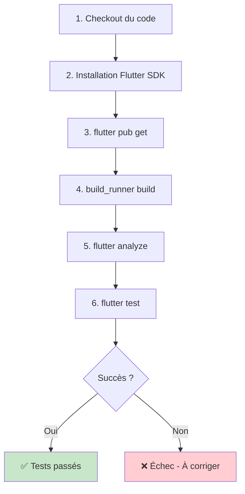
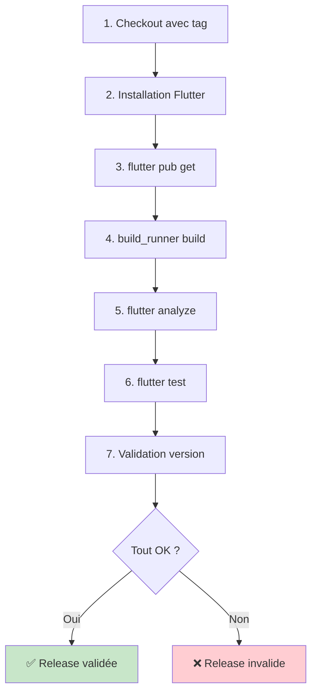

# Workflows CI/CD

## Vue d'ensemble

GardenUI utilise GitHub Actions pour automatiser l'analyse du code, les tests et la validation des releases. Ce document décrit les workflows configurés dans le projet.

## Workflow : analyze_and_test

**Fichier :** `.github/workflows/analyze_and_test.yml`

### Déclenchement

Ce workflow s'exécute automatiquement sur :
- Chaque **push** sur n'importe quelle branche
- Chaque **pull request** vers n'importe quelle branche

### Objectif

Garantir la qualité du code en :
1. Analysant le code pour détecter les erreurs et mauvaises pratiques
2. Exécutant tous les tests unitaires
3. Validant la compilation du projet

### Étapes du workflow



### Exemple de sortie

**✅ Succès :**
```
✓ Analyse statique : 0 erreurs, 0 avertissements
✓ Tests : 47/47 passés
✓ Build : Succès
```

**❌ Échec :**
```
✗ Analyse statique : 3 erreurs trouvées
  - lib/ui/widgets/atoms/Button/button.dart:12:5
    Prefer const with constant constructors
```

### Utilisation

Ce workflow est automatique. Lorsque vous créez une PR, GitHub affichera le statut :

- 🟢 **Checks passed** : Le code est prêt à être mergé
- 🔴 **Checks failed** : Des corrections sont nécessaires
- 🟡 **Checks in progress** : Workflow en cours d'exécution

---

## Workflow : release

**Fichier :** `.github/workflows/release.yml`

### Déclenchement

Ce workflow s'exécute automatiquement quand :
- Une nouvelle **Release GitHub** est créée
- Un tag est poussé au format `v*.*.*` (par exemple `v0.2.0`)

### Objectif

Valider et préparer la release pour publication :
1. Vérifier que le code compile correctement
2. Exécuter tous les tests
3. Valider la cohérence de la version dans `pubspec.yaml`
4. Générer les artefacts de release (si configuré)

### Étapes du workflow



### Validation de version

Le workflow vérifie que :
- Le tag Git correspond à la version dans `pubspec.yaml`
- Le CHANGELOG est à jour pour cette version
- Aucun test n'échoue

**Exemple :**
```yaml
Tag : v0.2.0
pubspec.yaml : version: 0.2.0
✓ Versions cohérentes
```

### Utilisation

1. Mettez à jour `pubspec.yaml` avec la nouvelle version
2. Créez un tag Git : `git tag -a v0.2.0 -m "Release v0.2.0"`
3. Poussez le tag : `git push origin v0.2.0`
4. Créez la Release GitHub
5. Le workflow s'exécute automatiquement

---

## Statuts des workflows

### Consulter les workflows

1. Allez sur GitHub : [https://github.com/JardinConnect/GardenUI](https://github.com/JardinConnect/GardenUI)
2. Cliquez sur l'onglet **Actions**
3. Sélectionnez un workflow dans la liste

### Interpréter les statuts

| Icône | Statut | Signification |
|-------|--------|---------------|
| ✅ | Success | Toutes les vérifications sont passées |
| ❌ | Failure | Au moins une vérification a échoué |
| 🟡 | In progress | Workflow en cours d'exécution |
| ⚪ | Skipped | Workflow ignoré (conditions non remplies) |
| 🔵 | Cancelled | Workflow annulé manuellement |

---

## Badges de statut

Vous pouvez ajouter des badges dans le README pour montrer le statut des workflows :

```markdown


```

---

## Déboguer un échec de workflow

### 1. Consulter les logs

1. Allez dans l'onglet **Actions**
2. Cliquez sur le workflow échoué
3. Cliquez sur l'étape en échec pour voir les logs détaillés

### 2. Reproduire localement

Exécutez les mêmes commandes que le workflow :

```bash
# Installation des dépendances
flutter pub get

# Génération du code
dart run build_runner build --delete-conflicting-outputs

# Analyse
flutter analyze

# Tests
flutter test
```

### 3. Corriger et repousser

```bash
# Corriger le code
git add .
git commit -m "fix: correction suite à l'échec du workflow"
git push
```

Le workflow se relancera automatiquement sur le nouveau push.

---

## Configuration personnalisée

### Ajouter des étapes

Pour ajouter une nouvelle étape à un workflow, modifiez le fichier YAML correspondant dans `.github/workflows/`.

**Exemple : Ajouter une vérification de couverture de code**

```yaml
- name: Run tests with coverage
  run: flutter test --coverage

- name: Check coverage threshold
  run: |
    # Script pour vérifier un seuil minimum de couverture
```

### Variables d'environnement

Définissez des variables d'environnement pour les workflows :

```yaml
env:
  FLUTTER_VERSION: '3.8.1'
  NODE_VERSION: '18'
```

---

## Secrets et tokens

Pour utiliser des secrets (API keys, tokens) dans les workflows :

1. Allez dans **Settings** > **Secrets and variables** > **Actions**
2. Cliquez sur **New repository secret**
3. Ajoutez votre secret
4. Utilisez-le dans le workflow :

```yaml
- name: Deploy to server
  env:
    API_TOKEN: ${{ secrets.API_TOKEN }}
  run: |
    # Commandes utilisant $API_TOKEN
```

---

## Optimisation des workflows

### Cache des dépendances

Pour accélérer les workflows, les dépendances Flutter/Dart sont mises en cache :

```yaml
- name: Cache Flutter dependencies
  uses: actions/cache@v3
  with:
    path: |
      ~/.pub-cache
      build/
    key: ${{ runner.os }}-flutter-${{ hashFiles('pubspec.lock') }}
```

### Exécution parallèle

Les tests peuvent être exécutés en parallèle pour gagner du temps :

```yaml
strategy:
  matrix:
    os: [ubuntu-latest, macos-latest, windows-latest]
```

---

## Bonnes pratiques

### ✅ À faire

- Toujours exécuter `flutter analyze` et `flutter test` localement avant de pousser
- Attendre que les workflows passent avant de merger une PR
- Consulter les logs en cas d'échec pour comprendre le problème
- Maintenir les workflows à jour avec les dernières versions de Flutter

### ❌ À éviter

- Merger une PR avec des workflows en échec
- Ignorer les warnings de `flutter analyze`
- Pousser du code non testé
- Désactiver les workflows pour "gagner du temps"

---

## Notifications

### Configurer les notifications

Vous pouvez configurer GitHub pour recevoir des notifications :

1. **Settings** > **Notifications**
2. Activez les notifications pour :
   - Échec de workflows
   - Succès de release
   - Revue de code nécessaire

### Intégrations

Intégrez avec des outils externes :
- **Slack** : Notifications dans un canal
- **Discord** : Webhooks pour les événements
- **Email** : Rapports automatiques

---

## Voir aussi

- [Comment publier une release](../how-to-guides/how-to-publish-release.md)
- [Comment exécuter les tests](../how-to-guides/how-to-run-tests.md)
- [Standards de code](coding-standards.md)
- [GitHub Actions Documentation](https://docs.github.com/en/actions)

